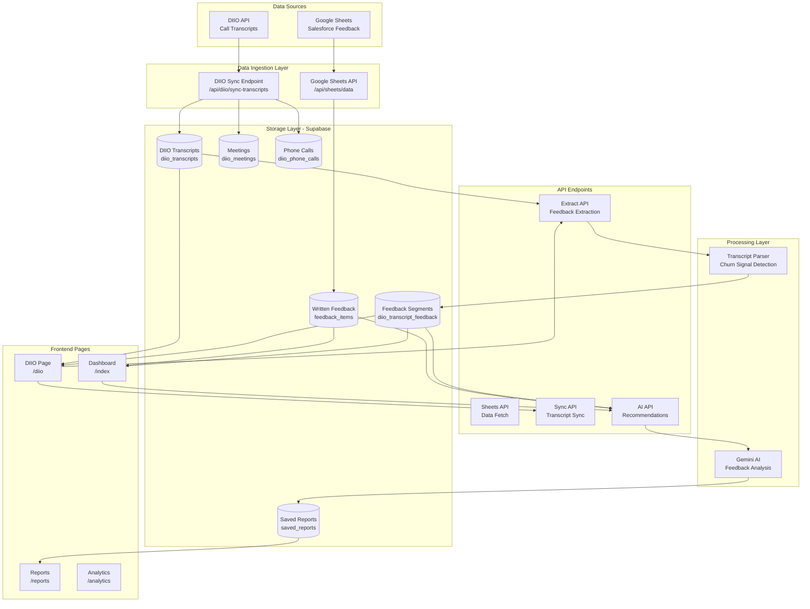

# 🏗️ Ontop Feedback Analytics - Architecture Diagram

**Last Updated:** December 2025  
**Version:** 2.2

---

## 📊 System Architecture Overview



---

## 🔄 Data Flow Diagrams

### 1. Written Feedback Flow (Google Sheets → Dashboard)

```
┌─────────────────┐
│  Google Sheets  │
│  (Salesforce)   │
└────────┬────────┘
         │
         │ 1. Fetch Data
         ▼
┌─────────────────┐
│ /api/sheets/    │
│ data.get.ts     │
└────────┬────────┘
         │
         │ 2. Store in DB
         ▼
┌─────────────────┐
│ Supabase        │
│ feedback_items  │
└────────┬────────┘
         │
         │ 3. Display
         ▼
┌─────────────────┐
│ Dashboard Page  │
│ /index          │
│ - Metrics       │
│ - Charts        │
│ - Recent Items  │
└─────────────────┘
```

### 2. DIIO Transcript Flow (Sync → Extract → Analyze)

```
┌─────────────────┐
│  DIIO API       │
│  - Meetings     │
│  - Phone Calls  │
└────────┬────────┘
         │
         │ 1. Sync Process
         ▼
┌─────────────────────────────────┐
│ /api/diio/sync-transcripts      │
│ - Fetch all meetings/calls       │
│ - Get transcript IDs            │
│ - Check existing in DB          │
│ - Fetch & store new transcripts  │
└────────┬─────────────────────────┘
         │
         │ 2. Store Metadata
         ▼
┌─────────────────┐      ┌─────────────────┐
│ diio_meetings   │      │ diio_phone_calls│
│ - Participants  │      │ - Participants  │
│ - Emails        │      │ - Emails        │
└─────────────────┘      └─────────────────┘
         │                         │
         └──────────┬──────────────┘
                    │
                    │ 3. Store Transcripts
                    ▼
         ┌─────────────────┐
         │ diio_transcripts│
         │ - Full text     │
         │ - Metadata      │
         └────────┬────────┘
                  │
                  │ 4. Automatic Extraction
                  ▼
┌─────────────────────────────────┐
│ /api/diio/extract-feedback      │
│ - Parse transcript text         │
│ - Detect churn signals          │
│ - Identify sentiment            │
│ - Classify feedback type        │
│ - Match speakers (seller/cust)  │
└────────┬────────────────────────┘
         │
         │ 5. Store Segments
         ▼
┌─────────────────────────────────┐
│ diio_transcript_feedback         │
│ - Feedback segments              │
│ - Churn signals                  │
│ - Sentiment                      │
│ - Speaker info                   │
└─────────────────────────────────┘
```

### 3. AI Analysis Flow

```
┌─────────────────┐      ┌─────────────────┐
│ Written Feedback│      │Call Transcripts │
│ (Google Sheets) │      │ (DIIO)          │
└────────┬────────┘      └────────┬────────┘
         │                         │
         └──────────┬──────────────┘
                    │
                    │ User clicks "Generate AI Report"
                    ▼
┌─────────────────────────────────┐
│ Dashboard (/index)              │
│ - Select filters                │
│ - Include transcripts? ☑        │
└────────┬────────────────────────┘
         │
         │ POST /api/ai/recommendations
         ▼
┌─────────────────────────────────┐
│ /api/ai/recommendations.post.ts │
│ - Fetch written feedback         │
│ - Fetch transcript feedback      │
│ - Combine data                   │
│ - Format for AI                  │
└────────┬────────────────────────┘
         │
         │ Send to Gemini AI
         ▼
┌─────────────────────────────────┐
│ Google Gemini AI                │
│ - Analyze patterns              │
│ - Generate insights              │
│ - Identify risks                 │
│ - Suggest actions                │
└────────┬────────────────────────┘
         │
         │ Return JSON response
         ▼
┌─────────────────────────────────┐
│ Dashboard Display               │
│ - Top Recurring Requests        │
│ - Emerging Patterns              │
│ - Critical Risks                 │
│ - Quick Wins                     │
└─────────────────────────────────┘
```

---

## 🎯 Churn Signal Detection Process

```
┌─────────────────────────────────┐
│ Transcript Text                  │
│ "We're having payment issues..." │
└────────┬────────────────────────┘
         │
         │ Parse & Analyze
         ▼
┌─────────────────────────────────┐
│ Transcript Parser                │
│ - Split into segments            │
│ - Identify speakers              │
│ - Extract keywords               │
└────────┬────────────────────────┘
         │
         │ Detect Signals
         ▼
┌─────────────────────────────────┐
│ Churn Signal Detection          │
│                                 │
│ ✓ Payment Issue (HIGH)          │
│ ✓ Recurring Problem (MEDIUM)    │
│ ✓ Negative Sentiment            │
└────────┬────────────────────────┘
         │
         │ Calculate Risk Score
         ▼
┌─────────────────────────────────┐
│ Churn Risk Score: 45/100        │
│ - Critical signals: 1            │
│ - High signals: 2                │
│ - Medium signals: 1              │
└────────┬────────────────────────┘
         │
         │ Store in Database
         ▼
┌─────────────────────────────────┐
│ diio_transcript_feedback        │
│ - feedback_text                  │
│ - feedback_type: pain_point      │
│ - urgency: high                  │
│ - sentiment: negative            │
│ - keywords: [payment, issue]    │
│ - churn_signals: [payment_issue]│
└─────────────────────────────────┘
```

---

## 📱 User Workflows

### Workflow 1: Daily Sync (Automatic)

```
┌─────────────────────────────────┐
│ Vercel Cron Job                 │
│ Runs daily at 2 AM UTC          │
└────────┬────────────────────────┘
         │
         │ GET /api/diio/sync-transcripts-daily
         ▼
┌─────────────────────────────────┐
│ Sync Process                     │
│ 1. Fetch meetings & calls        │
│ 2. Check for new transcripts     │
│ 3. Store new transcripts         │
│ 4. Auto-extract feedback         │
└────────┬────────────────────────┘
         │
         │ Results logged
         ▼
┌─────────────────────────────────┐
│ Supabase Database Updated        │
│ - New transcripts stored         │
│ - Feedback segments extracted    │
└─────────────────────────────────┘
```

### Workflow 2: CS Manager Reviews Dashboard

```
┌─────────────────────────────────┐
│ CS Manager                       │
│ Logs in to Dashboard             │
└────────┬────────────────────────┘
         │
         │ Views /index
         ▼
┌─────────────────────────────────┐
│ Dashboard                        │
│ - Total feedback: 1,247          │
│ - Sentiment breakdown            │
│ - Recent feedback list           │
│ - Account manager stats          │
└────────┬────────────────────────┘
         │
         │ Clicks "Generate AI Report"
         │ ☑ Includes transcripts
         ▼
┌─────────────────────────────────┐
│ AI Analysis (30-60 seconds)     │
│ - Analyzing 1,247 items          │
│ - Including 45 call transcripts  │
└────────┬────────────────────────┘
         │
         │ Display Results
         ▼
┌─────────────────────────────────┐
│ AI Insights                      │
│                                 │
│ 🎯 Top Requests:                 │
│ - Payment automation (High)      │
│                                 │
│ ⚠️ Critical Risks:              │
│ - 3 accounts mention churn       │
│                                 │
│ ⚡ Quick Wins:                  │
│ - CSV export (2 days)           │
└─────────────────────────────────┘
```

### Workflow 3: Manual Transcript Extraction

```
┌─────────────────────────────────┐
│ User on /diio page              │
└────────┬────────────────────────┘
         │
         │ Clicks "Extract Feedback"
         ▼
┌─────────────────────────────────┐
│ POST /api/diio/extract-feedback │
│ - Find unprocessed transcripts  │
│ - Process each transcript       │
└────────┬────────────────────────┘
         │
         │ For each transcript:
         ▼
┌─────────────────────────────────┐
│ Processing Steps:                │
│ 1. Get meeting/call metadata     │
│ 2. Extract participant emails    │
│ 3. Parse transcript text         │
│ 4. Detect churn signals          │
│ 5. Identify speakers              │
│ 6. Store feedback segments       │
└────────┬────────────────────────┘
         │
         │ Update UI Progress
         ▼
┌─────────────────────────────────┐
│ Progress Display                 │
│ Processing 15/50 transcripts     │
│ Extracted 127 feedback segments │
└─────────────────────────────────┘
```

---

## 🔐 Authentication & Security Flow

```
┌─────────────────────────────────┐
│ User visits app                 │
└────────┬────────────────────────┘
         │
         │ Check localStorage
         ▼
┌─────────────────────────────────┐
│ Auth Middleware                 │
│ (auth.global.ts)                │
└────────┬────────────────────────┘
         │
         ├─ Not authenticated ──► /login
         │
         └─ Authenticated ──► Continue to page
```

---

## 🗄️ Database Schema Relationships

```
┌─────────────────────────────────┐
│ diio_meetings                   │
│ - id (PK)                       │
│ - diio_meeting_id               │
│ - participant_emails[]          │
│ - last_transcript_id            │
└────────┬────────────────────────┘
         │
         │ References
         ▼
┌─────────────────────────────────┐
│ diio_transcripts                 │
│ - id (PK)                       │
│ - diio_transcript_id            │
│ - transcript_text               │
│ - source_id                     │
│ - feedback_extracted            │
└────────┬────────────────────────┘
         │
         │ Has Many
         ▼
┌─────────────────────────────────┐
│ diio_transcript_feedback         │
│ - id (PK)                       │
│ - transcript_id (FK)            │
│ - feedback_text                 │
│ - feedback_type                 │
│ - churn_signals (keywords)      │
│ - speaker_type                  │
└─────────────────────────────────┘
```

---

## 🔄 Complete System Flow

```
┌──────────────┐
│ DATA SOURCES │
└──────┬───────┘
       │
       ├──────────────────┐
       │                  │
       ▼                  ▼
┌──────────────┐    ┌──────────────┐
│ Google Sheets│    │   DIIO API   │
│ (Salesforce) │    │  (Transcripts)│
└──────┬───────┘    └──────┬───────┘
       │                   │
       │ Sync              │ Sync
       ▼                   ▼
┌──────────────┐    ┌──────────────┐
│   Supabase   │    │   Supabase   │
│ feedback_    │    │ diio_trans-  │
│ items        │    │ scripts      │
└──────┬───────┘    └──────┬───────┘
       │                   │
       │                   │ Extract
       │                   ▼
       │            ┌──────────────┐
       │            │ diio_trans-  │
       │            │ script_      │
       │            │ feedback     │
       │            └──────┬───────┘
       │                  │
       └──────────┬───────┘
                  │
                  │ Combine
                  ▼
         ┌─────────────────┐
         │  Gemini AI      │
         │  Analysis        │
         └────────┬─────────┘
                  │
                  │ Display
                  ▼
         ┌─────────────────┐
         │   Dashboard      │
         │   /index         │
         └──────────────────┘
```

---

## 📊 Key Components Breakdown

### Backend Services

| Component | Purpose | Location |
|-----------|---------|----------|
| **Google Sheets API** | Fetch feedback from Salesforce | `server/api/sheets/data.get.ts` |
| **DIIO Sync** | Sync transcripts from DIIO | `server/api/diio/sync-transcripts.post.ts` |
| **Feedback Extraction** | Extract feedback from transcripts | `server/api/diio/extract-feedback.post.ts` |
| **AI Recommendations** | Generate AI insights | `server/api/ai/recommendations.post.ts` |
| **Transcript Parser** | Parse & detect churn signals | `server/utils/transcriptParser.ts` |
| **DIIO Utils** | DIIO API authentication | `server/utils/diio.ts` |

### Frontend Pages

| Page | Route | Purpose |
|------|-------|---------|
| **Dashboard** | `/` | Main analytics, AI insights, feedback display |
| **Reports** | `/reports` | Generate and export reports |
| **DIIO** | `/diio` | Transcript management, sync, extraction |
| **Analytics** | `/analytics` | Advanced analytics (placeholder) |
| **Login** | `/login` | Authentication |
| **Test** | `/test` | Debug/testing |

### Database Tables

| Table | Purpose | Key Fields |
|-------|---------|------------|
| `feedback_items` | Written feedback from Sheets | feedback, sentiment, accountName |
| `diio_transcripts` | Full transcript text | transcript_text, source_id, feedback_extracted |
| `diio_transcript_feedback` | Extracted feedback segments | feedback_text, churn_signals, sentiment |
| `diio_meetings` | Meeting metadata | participant_emails, attendees |
| `diio_phone_calls` | Call metadata | participant_emails, attendees |
| `saved_reports` | Generated AI reports | report_html, report_data |

---

## 🚀 Key Features Flow

### Feature 1: Churn Signal Detection

```
Call Transcript
    ↓
Parse Text
    ↓
Detect Keywords
    ↓
Classify Signals:
  - Payment Issue
  - Worker Payout Issue
  - Recurring Problem
  - Price Negotiation
  - Customer Situation
  - Churn Categories (6 types)
    ↓
Calculate Risk Score (0-100)
    ↓
Store in Database
    ↓
Display in Dashboard
```

### Feature 2: AI-Powered Insights

```
Feedback Data (Written + Transcripts)
    ↓
Filter by Date/Manager/Account
    ↓
Send to Gemini AI
    ↓
AI Analysis:
  - Pattern Recognition
  - Sentiment Analysis
  - Risk Assessment
  - Action Suggestions
    ↓
Generate Insights:
  - Top Recurring Requests
  - Emerging Patterns
  - Critical Risks
  - Quick Wins
    ↓
Display in Dashboard
```

---

## 🔧 Technical Stack

```
┌─────────────────────────────────┐
│      Frontend (Nuxt 3)          │
│  - Vue 3 Composition API       │
│  - Tailwind CSS                 │
│  - TypeScript                   │
└────────┬────────────────────────┘
         │
         │ HTTP Requests
         ▼
┌─────────────────────────────────┐
│      Backend (Nuxt Server)       │
│  - API Routes                    │
│  - Server Utils                  │
└────────┬────────────────────────┘
         │
         ├─────────────────┐
         │                 │
         ▼                 ▼
┌──────────────┐   ┌──────────────┐
│  Supabase    │   │ External APIs│
│  (Database)  │   │ - Google      │
│              │   │   Sheets     │
│              │   │ - DIIO       │
│              │   │ - Gemini AI  │
└──────────────┘   └──────────────┘
```

---

## 📈 Data Processing Pipeline

```
┌─────────────────────────────────────────────┐
│              INPUT LAYER                    │
├─────────────────────────────────────────────┤
│ • Google Sheets (Salesforce feedback)        │
│ • DIIO API (Call transcripts)               │
└──────────────┬───────────────────────────────┘
               │
               ▼
┌─────────────────────────────────────────────┐
│          PROCESSING LAYER                    │
├─────────────────────────────────────────────┤
│ 1. Data Validation                          │
│ 2. Sentiment Analysis                       │
│ 3. Churn Signal Detection                   │
│ 4. Speaker Identification                   │
│ 5. Keyword Extraction                        │
│ 6. AI Pattern Recognition                   │
└──────────────┬───────────────────────────────┘
               │
               ▼
┌─────────────────────────────────────────────┐
│           STORAGE LAYER                      │
├─────────────────────────────────────────────┤
│ • Supabase PostgreSQL                       │
│ • Structured feedback data                  │
│ • Transcript segments                       │
│ • Churn signals                             │
│ • AI-generated reports                       │
└──────────────┬───────────────────────────────┘
               │
               ▼
┌─────────────────────────────────────────────┐
│          PRESENTATION LAYER                  │
├─────────────────────────────────────────────┤
│ • Interactive Dashboard                      │
│ • Real-time Metrics                          │
│ • AI Insights Display                        │
│ • Report Generation                          │
│ • Export Options (PDF, HTML)                 │
└─────────────────────────────────────────────┘
```

---

## 🎯 Use Cases

### Use Case 1: Proactive Churn Prevention

```
CS Manager logs in
    ↓
Dashboard shows churn risk alerts
    ↓
Views transcript feedback with high risk score
    ↓
Sees specific churn signals:
  - "Payment issues"
  - "Price negotiations"
  - "Customer situation changes"
    ↓
Takes proactive action:
  - Reaches out to at-risk account
  - Addresses concerns before cancellation
```

### Use Case 2: Feature Prioritization

```
Product Manager reviews AI insights
    ↓
Sees "Top Recurring Requests"
    ↓
Notices "Payment automation" mentioned:
  - 15 written feedback items
  - 8 call transcripts
  - High urgency
  - $125K MRR affected
    ↓
Prioritizes feature in roadmap
```

### Use Case 3: Weekly Executive Report

```
CS Manager generates AI report
    ↓
Selects date range (last 7 days)
    ↓
Includes both written + call feedback
    ↓
AI generates comprehensive report:
  - Summary of feedback
  - Key insights
  - Action items
  - Risk assessment
    ↓
Exports as PDF
    ↓
Shares with leadership
```

---

## 🔄 Automatic Workflows

### Daily Sync Workflow

```
Vercel Cron (2 AM UTC)
    ↓
/api/diio/sync-transcripts-daily
    ↓
1. Fetch meetings from DIIO
2. Fetch phone calls from DIIO
3. Check for new transcripts
4. Store new transcripts
5. Automatically extract feedback
6. Update database
```

### Manual Sync Workflow

```
User clicks "Sync New Transcripts"
    ↓
/api/diio/sync-transcripts
    ↓
Same process as daily sync
    ↓
Real-time progress display
    ↓
Shows results with extraction stats
```

---

## 📋 Component Interactions

```
┌──────────────┐
│   Dashboard  │
│  (index.vue) │
└──────┬───────┘
       │
       ├─► useGoogleSheets() ──► Fetch feedback
       ├─► useSupabase() ──► Get feedback segments
       ├─► useAIRecommendations() ──► Generate insights
       └─► useSentimentAnalysis() ──► Classify sentiment
       
┌──────────────┐
│   DIIO Page  │
│  (diio.vue)  │
└──────┬───────┘
       │
       ├─► useSupabase() ──► Get transcripts
       ├─► POST /sync-transcripts ──► Sync
       └─► POST /extract-feedback ──► Extract
```

---

## 🎨 Visual Architecture Summary

```
                    ┌─────────────────┐
                    │   USER ACCESS   │
                    │  (Browser)      │
                    └────────┬────────┘
                             │
                             ▼
                    ┌─────────────────┐
                    │  Nuxt 3 App     │
                    │  (Frontend)    │
                    └────────┬────────┘
                             │
        ┌────────────────────┼────────────────────┐
        │                    │                    │
        ▼                    ▼                    ▼
┌──────────────┐    ┌──────────────┐    ┌──────────────┐
│   Pages      │    │  Composables │    │  Components  │
│  - index     │    │  - useAI     │    │  - Modals    │
│  - diio      │    │  - useSupabase│   │  - UI        │
│  - reports   │    │  - useSheets │    │              │
└──────────────┘    └──────────────┘    └──────────────┘
        │                    │                    │
        └────────────────────┼────────────────────┘
                             │
                             ▼
                    ┌─────────────────┐
                    │  API Endpoints  │
                    │  (Server)       │
                    └────────┬────────┘
                             │
        ┌────────────────────┼────────────────────┐
        │                    │                    │
        ▼                    ▼                    ▼
┌──────────────┐    ┌──────────────┐    ┌──────────────┐
│  Supabase    │    │  External    │    │  AI Services │
│  Database    │    │  APIs        │    │              │
│              │    │  - Google    │    │  - Gemini    │
│              │    │  - DIIO      │    │              │
└──────────────┘    └──────────────┘    └──────────────┘
```

---

## 📝 Notes

- **Data Flow:** All data flows through Supabase for centralized storage and querying
- **AI Analysis:** Combines written feedback + transcript feedback for comprehensive insights
- **Churn Detection:** Real-time signal detection from transcripts before issues escalate
- **Automation:** Daily sync ensures fresh data without manual intervention
- **Scalability:** Batch processing handles large datasets efficiently

---

_Last Updated: December 2025_  
_For technical details, see README.md and DIIO_API_CONNECTION_CODE.md_

